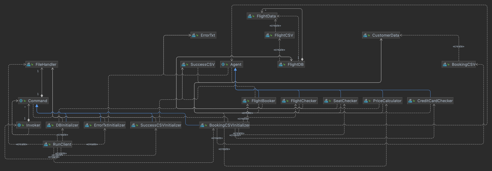
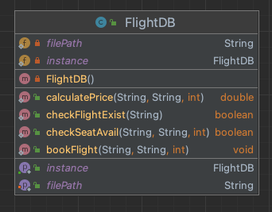
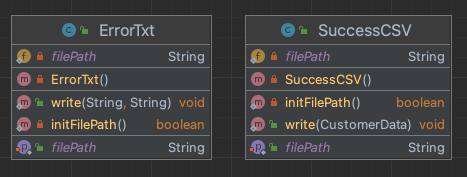
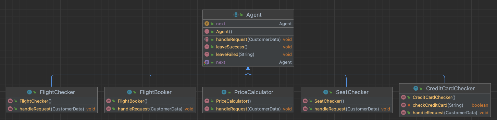
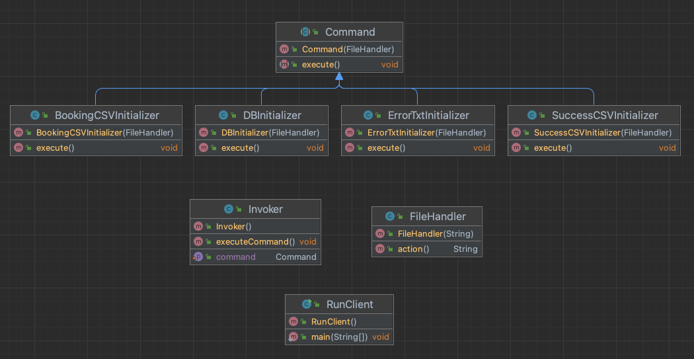

# Individual Project: Flight Booking Application  
*[Spring '22] CMPE-202: Software Systems Engineering*  
**Professor: Gopinath Vinodh**  
**Student: Allen Wu**  

## Objective
Build a Flight Booking Application to help a list of customers booking flight tickets.

## Project Requirements
1. Java and Maven enabled.
2. Junit test cases covered all classes and methods
3. Flight Booking Application in following order:
>  1. [Validate] Flight Existing
>  2. [Validate] Class & Seat Availability
>  3. [Calculate] Ticket Price
>  4. [Validate] Credit Card
>  5. [Book] Ticket
4. Three design patterns

## Report Requirements
1. Instruction:
  * [Building the project and Steps to execute](#steps-to-execute)
2. Question:
>  1. Describe what is the primary problem you try to solve
>     * The primary problem is how to ensure all classes access the same Output File Handler and Flight Database to prevent duplicate and cause wrong result. In this case, I want to find out a design pattern and the classes can ensure that they always access the same one.
>  2. Describe what are the secondary problems you try to solve
>     * The secondary problems is that I want to find out the what is the best design pattern to deal with the chain trivial process in booking the flight ticket.
>  3. Describe what design pattern(s) you use how (use plain text and diagrams)
>     * [Desing Pattern](#design-pattern)
>  4. Describe the consequences of using this/these pattern(s)
>     * Singleton will keep the same instance in whole runtime, so I need to implement it with thread-safe method to create it only one.
>     * Chain of Responsibility pattern may sometime leave requests no one handling.
>     * Command pattern will introduce a layer between sender and receiver which will increase complexity. 
>  5. Class diagram
>     * [Class Diagram](#class-relationship)
3. Screenshots of test execution and result
  * [Unit Test](#unit-test)
  * [Execution and Result](#execution-and-result)

## Input
1. [CSV] Customer information
2. [CSV] Flight information

## Output
1. [CSV] Successful booking information
2. [TXT] Fail booking customers and resons

## Steps to execute
* Maven
>  1. mvn compile
>  2. mvn clean install
>  3. mvn exec:java -Dexec.mainClass=test.RunClient -Dexec.args="\<in1> \<in2> \<out1> \<out2>"
* Makefile
>  1. make build
>     * Same as Maven step1 and step2
>  2. make run
>     * Same as Maven step3
>  3. make diff
>     * Check the output difference from step3 vs golden
>  4. make test
>     * Run regression testing for Java classes.
>  5. make clean
>     * Remove build and output files.

## Class Relationship

## Design Pattern
1. Singleton  
Only one instance in the problem to prevent duplicate.  
Implement Flight Database and Output File Handlers with Singleton Design Pattern.  

2. Chain of Responsibility  
Deal part of the request and send to another agent after it succeed.  
Implement Airline Agents with Chain of Responsibility Design Pattern. 

3. Command  
Call an invoker and assign them with lots of commands, each commands will do its own job.
Implement Invoker with Command Design Pattern.  

## Unit Test
Tool: Junit 5  
Total Unit Test: 24  

## Execution and Result
  
  
